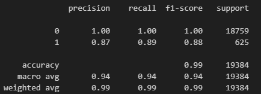
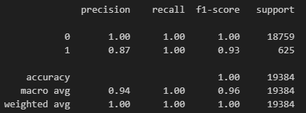

Credit Risk Classification
## Overview of the Analysis

Utilizing machine learning techniques, we examined a dataset comprising historical lending activities from a peer-to-peer lending services company. The objective was to construct a model capable of assessing the creditworthiness of borrowers.

Key factors considered in the analysis encompassed:

1. Loan size
2. Interest rate
3. Borrower's income
4. Debt-to-income ratio
5. Number of accounts held by the borrower
6. Derogatory marks against the borrower
7. Total debt

The dataset, comprising 77,536 data points, was divided into training and testing sets. The training set facilitated the development of an initial logistic regression model (Logistic Regression Model 1), employing the LogisticRegression module from scikit-learn. This model was subsequently applied to the testing dataset to determine the risk level of loans, categorizing them as low- or high-risk. The initial model drew from a dataset with 75,036 low-risk loan data points and 2,500 high-risk data points.

To address data imbalance, the training set was resampled using the RandomOverSampler module from imbalanced-learn. This resulted in 56,277 data points for both low-risk (0) and high-risk (1) loans.

A new logistic regression model (Logistic Regression Model 2) was then built using the resampled data. The objective remained to classify loans in the testing set as low- or high-risk. The results are outlined below.

## Results

Below is an overview of the accuracy, balanced accuracy, precision, and recall scores for the two machine learning models employed in the activity:

Machine Learning Model 1 - Logistic Regression:

Logistic Regression - Classification Report:

* This model demonstrates proficiency in predicting both healthy and high-risk loans, evident from its high accuracy score of 99.18% and balanced accuracy score of 95.20%. However, it's essential to acknowledge the imbalance in the data, with 96.77% of target values (75,036 out of 77,536) corresponding to healthy loans.

* Precision scores are 100% for healthy loans and 85% for high-risk loans, reflective of the data imbalance. While healthy loans are consistently classified correctly, high-risk loans see an 85% precision.

* Recall scores are 99% for healthy loans and 91% for high-risk loans. This indicates that the model correctly identifies healthy loans in 99% of instances but achieves an accuracy of 91% for high-risk loans.

Machine Learning Model 2 - RandomOverSampler:

Key results from the Logistic Regression model applied to data resampled through RandomOverSampler:

RandomOverSampler - Classification Report:

* This model excels in predicting both healthy and high-risk loans, with a high accuracy score of 99.38% and a balanced accuracy score of 99.37%.

* Precision scores are 100% for healthy loans and 84% for high-risk loans. While healthy loans are consistently classified correctly, the precision for high-risk loans is 84%.

* Recall scores are 99% for healthy loans and an impressive 99% for high-risk loans. The model correctly identifies both healthy and high-risk loans in 99% of instances.

Summary:
Based on the results:

* The RandomOverSampler model outperforms the logistic regression model applied to oversampled data, showcasing higher accuracy and balanced accuracy scores.

* The RandomOverSampler model excels in correctly predicting loans, particularly for high-risk loans, with superior recall scores. Correctly identifying high-risk loans is crucial for reducing defaults and enhancing overall company profitability.

Based on the outlined factors, the recommendation is to utilize the RandomOverSampler method to resample the data, mitigating the overweighting towards healthy loans. This approach, followed by Logistic Regression, yields superior accuracy and recall scores—critical decision metrics for lending service companies.